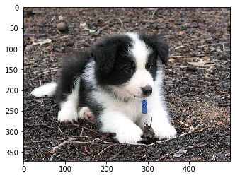

Návrh zadania
=============

Motivácia
---------
V našej práci budeme klasifikovať plemená psov. Klasifikácia objektov v obrázkoch pomocou konvolučných neurónových sietí je pomerne prebádaná oblasť. V našom projekte sa budeme snažiť overiť viacero postupov a architektúr strojového učenia použitého pri klasifikácii obrázkov. Pomocou moderných techník sa budeme pokúšať dosiahnúť výsledky porovnateľné s výsledkami súčasných metdód.

Súvisiaca práca
---------------
Problém klasifikácie plemien psovbol riešený viacerými autormi. Väčšina týchto prác používala subset datasetu [Stanford dog dataset](http://vision.stanford.edu/aditya86/ImageNetDogs/) o veľkosti 10,222 obrázkov, ktoré obsahovali 120 plemien psov. Všetci autori používali na riešenie tohto problému konvolučné neurónové siete. Autori tohto [článku](https://medium.com/@claymason313/dog-breed-image-classification-1ef7dc1b1967) robili porovnávanie viacerých architektúr sieti riešiacich tento problém. Prvou architektúrou bola sieť skladajúca sa z troch konvolučných vrstiev, ktoré nasledovali pooling vrstvy, sieť bola zakončená plne spojitou vrstvou so softmax aktivačnou funkciou. Táto sieť dosahovala na testovacej množine presnosť len 1%. Následne autori skúšali sieť, ktorá sa skladala z "inception" modulov. Inception vrstva je vrstva, ktorá transformuje(konvolúciou) vstup rôznymi spôsobmi a spojí výsledky týchto transformácii do jedného. Táto sieť dosiahla presnosť 10% na testovacej množine. Ako tretí prístup na riešenie problému autori predstavili transfer learning, teda použitie predtrénovaných sietí. Konkrétne využili siete ako VGG 16, MobileNet, Inception V3, ResNet50. Najlepšie výsledky dosahovala sieť Inception V3 s presnosťou 77% na testovacej množine.

Dataset
-------

Pri riešení nášho projektu budeme používať [Stanford dog
dataset](http://vision.stanford.edu/aditya86/ImageNetDogs/), ktorý obsahuje
20,580 obrázkov 120 plemien psov. Tento odataset obsahuje anotácie a obrázky z
ImageNet-u, čo je databáza obrázkov navrhnutá na výskum v oblasti rozpoznávania
obrázkov.

Samotné dáta obsahujú obrázky rôznej veľkosti vo formáte jpg a ďalšie doplňujúce
informácie v xml formáte ako plemeno psa, veľkosť obrázku a bounding box.

Obrzok z datasetu

~~~~~~~~~~~~~~~~~~~~~~~~~~~~~~~~~~~~~~~~~~~~~~~~~~~~~~~~~~~~~~~~~~~~~~~~~~~~~~~~
<annotation>
    <folder>02106166</folder>
    <filename>n02106166_1031</filename>
    <source>
        <database>ImageNet database</database>
    </source>
    <size>
        <width>500</width>
        <height>372</height>
        <depth>3</depth>
    </size>
    <segment>0</segment>
    <object>
        <name>Border_collie</name>
        <pose>Unspecified</pose>
        <truncated>0</truncated>
        <difficult>0</difficult>
        <bndbox>
            <xmin>11</xmin>
            <ymin>46</ymin>
            <xmax>376</xmax>
            <ymax>334</ymax>
        </bndbox>
    </object>
</annotation>
~~~~~~~~~~~~~~~~~~~~~~~~~~~~~~~~~~~~~~~~~~~~~~~~~~~~~~~~~~~~~~~~~~~~~~~~~~~~~~~~

## Návrh riešenia
-----------------
Náš prvý krok riešenia bude spočívať v analýze poskytnutých dát. Pokračovať budeme predspracovaním dát, čo bude zahŕňat prepísanie anotácii z XML formátu do csv formátu, orezanie obrázkov pomocou bounding box súradníc, úpravu dimenzií obrázkov a normálizáciu dát. Následne budeme pokračovať so samotným trénovaním siete. Pri trénovaní vyskúšame našu vlastnú architektúru siete a aj iné súčasné architektúry využívajúce sa pri klasifikácii obrázkov. Pri trénovaní použijeme techniku prehľadávania hyperparametrov gridsearch, taktiež augmentáciu dát na zväčšenie trénovacej množiny. Pri používaní iných architektúr môžeme skúsiť použiť aj techniku transfer learning a porovnať výsledky s našou architektúrou. Výsledky použitých architektúr následne porovnáme a vyvodíme z nich závery.
