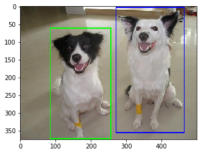
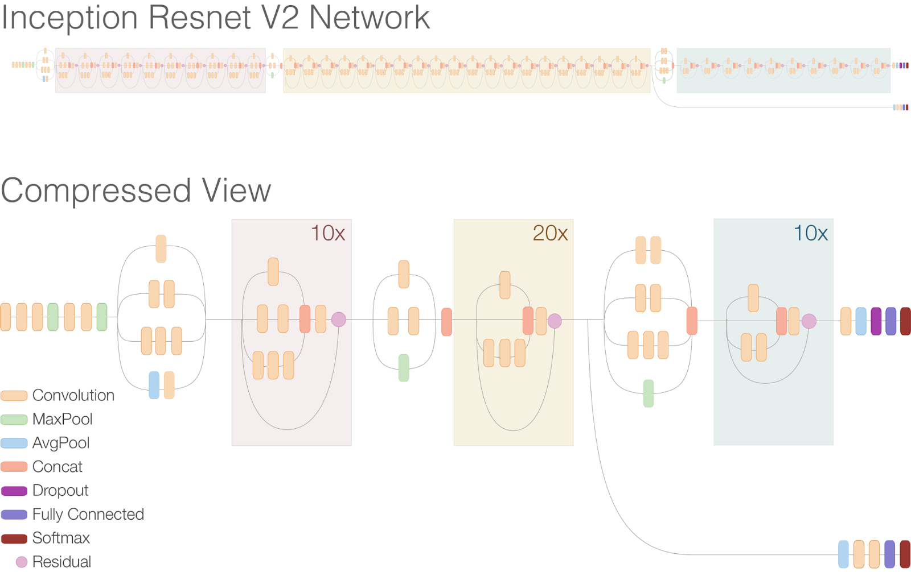

# Dokumentácia riešenia
Tento dokument obsahuje popis riešenia nášho projektu.

## Dáta
Naše dáta pochádzajú zo Stanford Dog Datasetu, sú to obrázky získané z ImageNet databázy. Dataset obsahuje 22126 obrázkov psov 120 rôznych plemien.

## Preprocessing
Každý obrázok obsahoval aspoň jedného psa, pričom pre každého psa na obrázku boli uvedené bounding box súradnice, podľa ktorých sme psov z obrázkov vyrezávali. Následne sme každý vyrezaný obrázok interpolovali na veľkost 299x299 pixelov.


## Použité architektúry
Celkovo sme použili štyri architektúry z čoho dve boli naše vlastné. 

### BaseConv 
Prvou našou sieťou bola obyčajná konvolučná sieť so štyrmi konvolučnými vrstvami. Každá konvolučná vrstva je nasledovaná MaxPooling vrsrvou s kernelom (2,2). Za posledným MaxPoolingom sa nachádza Droupot vrstva(0.25).

```
Layer (type)                            
================================
conv2d (Conv2D)                   
________________________________
max_pooling2d (MaxPooling2,2)     
________________________________
conv2d_1 (Conv2D)            
________________________________
max_pooling2d_1 (MaxPooling2,2)   
________________________________
conv2d_2 (Conv2D)            
________________________________
max_pooling2d_2 (MaxPooling2,2)   
________________________________
conv2d_3 (Conv2D)            
________________________________
max_pooling2d_3 (MaxPooling2,2)     
________________________________
dropout (Dropout 0,25)            
________________________________
flatten (Flatten)            
________________________________
dense (Dense)                 
________________________________
dense_1 (Dense)                
================================
```
### Inception
Druhou použitou sieťou je naša verzia Inception siete, ktorá využívala Inception vrstvy. Celkovo sa sieť skladá zo štytorch takýchto Inception vrstviev. Každú Inception vrstvu nasleduje MaxPooling vrsrva s kernelom (2,2).


```
Layer (type)                 
================================
inception_layer (Inception)  
________________________________
max_pooling2d_1 (MaxPooling2,2)      
________________________________
inception_layer_1 (Inception)    
________________________________
max_pooling2d_3 (MaxPooling2,2)    
________________________________
inception_layer_2 (Inception   
________________________________
max_pooling2d_5 (MaxPooling2,2)      
________________________________
inception_layer_3 (Inception)    
________________________________
max_pooling2d_7 (MaxPooling2,2) 
________________________________
flatten (Flatten)            
________________________________
dense (Dense)                  
________________________________
dense_1 (Dense)                   
================================
```

### InceptionV3
[Táto sieť je preddefinovaná v knižnici Keras](https://keras.io/applications/#inceptionv3). Používali sme jej nepredtrénovanú verziu. Táto verzia siete obsahuje taktiež Inception vrstvy ako naša navrhovaná sieť, avšak nepoužíva 5x5 konvolúciu, ale dve 3x3 konvolúcie, čím sa zmenšil počet trénovateľných parametrov siete. Celkovo má táto sieť 42 vrstiev. Bližšie detajly k tejto sieti je možné získať [tu](https://www.cv-foundation.org/openaccess/content_cvpr_2016/papers/Szegedy_Rethinking_the_Inception_CVPR_2016_paper.pdf).


### InceptionResNetV2
InceptionResNetV2 obsahuje Inception vrstvy, ktoré sú oproti InceptionV3 zjednodušené, taktiež je táto sieť oproti V3 hlbšia. Hlavným vylepšením tejto siete sú reziduálne spojenia,ktoré napomáhajú pri trénovaní extrémne hlbokých sietí. Celá špecifikácie siete je [tu](https://arxiv.org/pdf/1602.07261.pdf).




