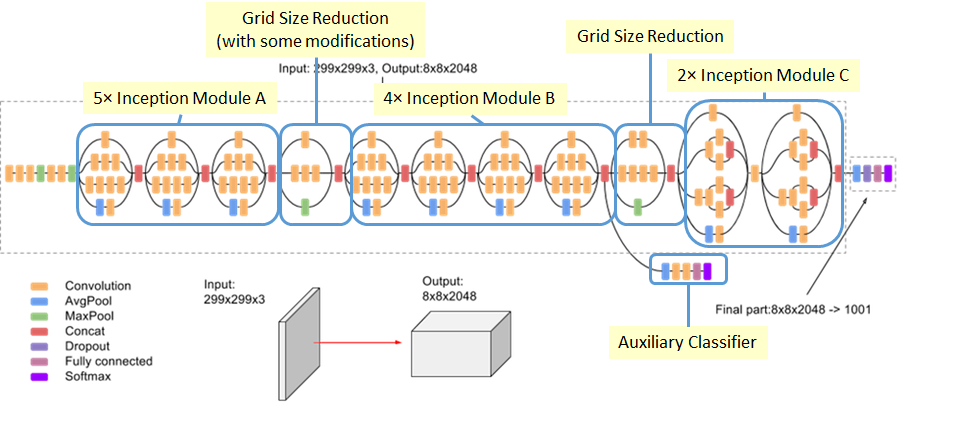
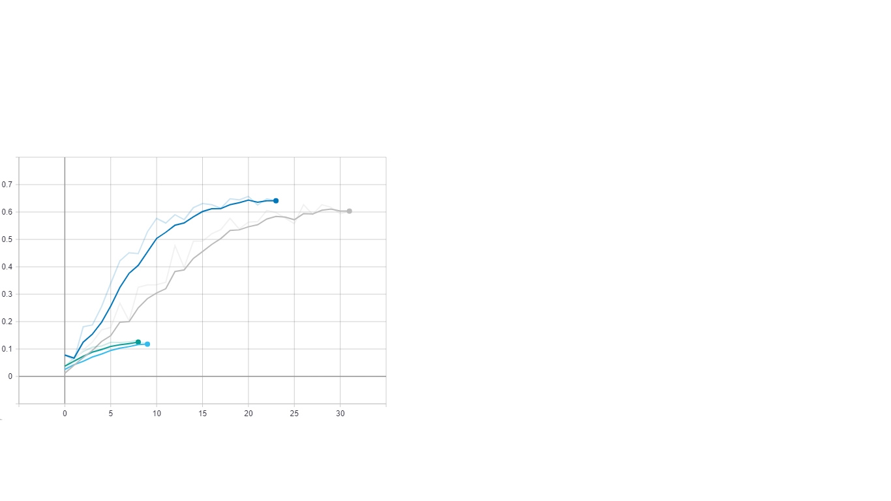

Dokumentácia riešenia
=====================

Tento dokument obsahuje popis riešenia nášho projektu. Návod na spustenie
skriptov sa nachádza v README.md v roote projektu.

Dáta
----

Naše dáta pochádzajú zo Stanford Dog Datasetu, sú to obrázky získané z ImageNet
databázy. Dataset obsahuje 22126 obrázkov psov 120 rôznych plemien. Nad týmto
dátami sme vykonali dátovú analýzu, ktorá sa nachádza v súbore
./notebooks/[data_analysis.ipynb](http://127.0.0.1:8889/notebooks/notebooks/data_analysis.ipynb).

Predspracovanie
---------------

Každý obrázok obsahoval aspoň jedného psa, pričom pre každého psa na obrázku
boli uvedené bounding box súradnice, podľa ktorých sme psov z obrázkov
vyrezávali. Následne sme každý vyrezaný obrázok interpolovali na veľkost 299x299
pixelov.

Bouding boxes

Bouding boxes

Použité architektúry
--------------------

Celkovo sme použili štyri architektúry z čoho dve boli naše vlastné.

### BaseConv

Prvou našou sieťou bola obyčajná konvolučná sieť so štyrmi konvolučnými
vrstvami. Každá konvolučná vrstva je nasledovaná MaxPooling vrsrvou s kernelom
(2,2). Za posledným MaxPoolingom sa nachádza Droupot vrstva(0.25).

~~~~~~~~~~~~~~~~~~~~~~~~~~~~~~~~~~~~~~~~~~~~~~~~~~~~~~~~~~~~~~~~~~~~~~~~~~~~~~~~
Layer (type)                            
================================
conv2d (Conv2D)                   
________________________________
max_pooling2d (MaxPooling2,2)     
________________________________
conv2d_1 (Conv2D)            
________________________________
max_pooling2d_1 (MaxPooling2,2)   
________________________________
conv2d_2 (Conv2D)            
________________________________
max_pooling2d_2 (MaxPooling2,2)   
________________________________
conv2d_3 (Conv2D)            
________________________________
max_pooling2d_3 (MaxPooling2,2)     
________________________________
dropout (Dropout 0,25)            
________________________________
flatten (Flatten)            
________________________________
dense (Dense)                 
________________________________
dense_1 (Dense)                
================================
~~~~~~~~~~~~~~~~~~~~~~~~~~~~~~~~~~~~~~~~~~~~~~~~~~~~~~~~~~~~~~~~~~~~~~~~~~~~~~~~

### Inception

Druhou použitou sieťou je naša verzia Inception siete, ktorá využívala Inception
vrstvy. Celkovo sa sieť skladá zo štytorch takýchto Inception vrstviev. Každú
Inception vrstvu nasleduje MaxPooling vrsrva s kernelom (2,2).

Inception layer

Inception layer

~~~~~~~~~~~~~~~~~~~~~~~~~~~~~~~~~~~~~~~~~~~~~~~~~~~~~~~~~~~~~~~~~~~~~~~~~~~~~~~~
Layer (type)                 
================================
inception_layer (Inception)  
________________________________
max_pooling2d_1 (MaxPooling2,2)      
________________________________
inception_layer_1 (Inception)    
________________________________
max_pooling2d_3 (MaxPooling2,2)    
________________________________
inception_layer_2 (Inception   
________________________________
max_pooling2d_5 (MaxPooling2,2)      
________________________________
inception_layer_3 (Inception)    
________________________________
max_pooling2d_7 (MaxPooling2,2) 
________________________________
flatten (Flatten)            
________________________________
dense (Dense)                  
________________________________
dense_1 (Dense)                   
================================
~~~~~~~~~~~~~~~~~~~~~~~~~~~~~~~~~~~~~~~~~~~~~~~~~~~~~~~~~~~~~~~~~~~~~~~~~~~~~~~~

### InceptionV3

[Táto sieť je preddefinovaná v knižnici
Keras](https://keras.io/applications/#inceptionv3). Používali sme jej
nepredtrénovanú verziu. Táto verzia siete obsahuje taktiež Inception vrstvy ako
naša navrhovaná sieť, avšak nepoužíva 5x5 konvolúciu, ale dve 3x3 konvolúcie,
čím sa zmenšil počet trénovateľných parametrov siete. Celkovo má táto sieť 42
vrstiev. Bližšie detajly k tejto sieti je možné získať
[tu](https://www.cv-foundation.org/openaccess/content_cvpr_2016/papers/Szegedy_Rethinking_the_Inception_CVPR_2016_paper.pdf).

InceptionV3

InceptionV3

### InceptionResNetV2

InceptionResNetV2 obsahuje Inception vrstvy, ktoré sú oproti InceptionV3
zjednodušené, taktiež je táto sieť oproti V3 hlbšia. Hlavným vylepšením tejto
siete sú reziduálne spojenia,ktoré napomáhajú pri trénovaní extrémne hlbokých
sietí. Celá špecifikácie siete je [tu](https://arxiv.org/pdf/1602.07261.pdf).

InceptionV3

InceptionV3

Trénovanie
----------

Na trénovanie sme používali 80% obrázkov z celej množiny, validovali sme na
ostatných 20% obrázkov. Pri trénovaní sme taktiež využili augmentáciu s
nasledujúcimi parametrami:

~~~~~~~~~~~~~~~~~~~~~~~~~~~~~~~~~~~~~~~~~~~~~~~~~~~~~~~~~~~~~~~~~~~~~~~~~~~~~~~~
horizontal_flip=True,
rotation_range=30,
zoom_range=0.15,
shear_range=0.15,
width_shift_range=0.2,
height_shift_range=0.2,
fill_mode="nearest"
~~~~~~~~~~~~~~~~~~~~~~~~~~~~~~~~~~~~~~~~~~~~~~~~~~~~~~~~~~~~~~~~~~~~~~~~~~~~~~~~

Príklad augmentovaných obrázkov(prvý obrázok je originál):

Augmentácia

Augmentácia

Na zastavenie trénovania sme používali techniku skorého zastavenia, ktoré
sledovalo hodnotu validačnej loss funkcie, ak sa hodnota loss funkcie nezlepšila
5 epóch za sebou, tak sa trénovanie zastavilo a váhy modelu sa nastavili na
posledné s najlepšou hodnotou validačnej loss funkcie.

Experimenty
-----------

Experimenty sme vykonávali pomocou virtuálneho stroja na Google cloude. Pre
potreby použitia tejto VM sme si vytvorili vlastný docker image založený na
image z Tensorflowu podporujúceho výpočet na grafickej karte. Do nášho image sme
si doinštalovali ostatné knižnice potrebné pre spustenie našich skriptov. Logy z
trénovania modelov našich sieti sa nachádzajú v priečinku /logs.

Pre potreby vykonávania experimentov sme pri jednotlivých experimentoch použili
grafické karty Nvidia Tesla K80 a Nvidia Tesla V100.

Jednotlivé príkazy, ktoré sme použili na trénovanie našich modelov sieti sa
nachádzajú v súbore ./notebooks/model_training.ipynb Výsledky trénovania
uvádzame v tejto dokumentácií z dôvodu, že po spustení príkazov cez jupyter
notebook nám padal kernel a nedalo sa týmto spôsobom trénovať.

### InceptionV3 experiment

~~~~~~~~~~~~~~~~~~~~~~~~~~~~~~~~~~~~~~~~~~~~~~~~~~~~~~~~~~~~~~~~~~~~~~~~~~~~~~~~
batch_size=64,
learning_rate=0.0005,
augmentation=True,
~~~~~~~~~~~~~~~~~~~~~~~~~~~~~~~~~~~~~~~~~~~~~~~~~~~~~~~~~~~~~~~~~~~~~~~~~~~~~~~~

~~~~~~~~~~~~~~~~~~~~~~~~~~~~~~~~~~~~~~~~~~~~~~~~~~~~~~~~~~~~~~~~~~~~~~~~~~~~~~~~
epochs=40(31 done)
~~~~~~~~~~~~~~~~~~~~~~~~~~~~~~~~~~~~~~~~~~~~~~~~~~~~~~~~~~~~~~~~~~~~~~~~~~~~~~~~

Experiment, pri ktorom sme použili model InceptionV3 sme trénovali celkovo viac
ako osem hodín na karte Nvidia Tesla K80. Model sa trénoval celkovo 31 epoch,
pričom najlepšia dosiahnutá presnosť na validačných dátach bola 60.26%.

### InceptionResNet experiment

~~~~~~~~~~~~~~~~~~~~~~~~~~~~~~~~~~~~~~~~~~~~~~~~~~~~~~~~~~~~~~~~~~~~~~~~~~~~~~~~
batch_size=32,
learning_rate=0.0005,
augmentation=True,
~~~~~~~~~~~~~~~~~~~~~~~~~~~~~~~~~~~~~~~~~~~~~~~~~~~~~~~~~~~~~~~~~~~~~~~~~~~~~~~~

~~~~~~~~~~~~~~~~~~~~~~~~~~~~~~~~~~~~~~~~~~~~~~~~~~~~~~~~~~~~~~~~~~~~~~~~~~~~~~~~
epochs=40(23 done)
~~~~~~~~~~~~~~~~~~~~~~~~~~~~~~~~~~~~~~~~~~~~~~~~~~~~~~~~~~~~~~~~~~~~~~~~~~~~~~~~

Pre potreby rýchlejšieho trénovania pomocou tejto siete sme použili grafickú
kartu Nvidia Tesla V100. Na tejto grafickej karte bol priemerný čas na výpočet
jednej epochy približne 15 minút. To je v porovnaní s grafickou kartou Nvidia
Tesla K80 3 krát nižší čas pri rovnakej sieti. Nutnosťou pri trénovaní modelu
tejto siete bolo zníženie veľkosti batch na 32, z dôvodu, že väčší sa nezmestil
do pamäte RAM grafickej karty.

Celkovo sme tento model trénovali 5h 46 minút. Po v tomto čase sme dosiahli
opakovane nemeniace sa hodnoty loss funkcie, a teda trénovanie sa zastavilo po
23 epochách. Natrénovaný model dosahuje správnosť 64,14% na validačnej množine
dát a tiež hodnota funkcie loss=1,52.

### Inception experiment – vlastná sieť

~~~~~~~~~~~~~~~~~~~~~~~~~~~~~~~~~~~~~~~~~~~~~~~~~~~~~~~~~~~~~~~~~~~~~~~~~~~~~~~~
batch_size=32,
learning_rate=0.0001,
augmentation=False,
~~~~~~~~~~~~~~~~~~~~~~~~~~~~~~~~~~~~~~~~~~~~~~~~~~~~~~~~~~~~~~~~~~~~~~~~~~~~~~~~

~~~~~~~~~~~~~~~~~~~~~~~~~~~~~~~~~~~~~~~~~~~~~~~~~~~~~~~~~~~~~~~~~~~~~~~~~~~~~~~~
epochs=10(9 done)
~~~~~~~~~~~~~~~~~~~~~~~~~~~~~~~~~~~~~~~~~~~~~~~~~~~~~~~~~~~~~~~~~~~~~~~~~~~~~~~~

Trénovanie vlastných sieti sme vykonali ešte raz po úprave niektorých funkcií.
Model sme tento krát trénovali použitím grafickej karty Nvidia Tesla V100.
Trénovanie, ktoré sa skončilo po 9 epoche z 10 nastavených dosiahlo správnosť
12,04% hodnotu funkcie loss=4,58, tieto hodnoty boli dosiahnuté na validačných
dátach.

### BaseConv experiment – vlastná sieť

~~~~~~~~~~~~~~~~~~~~~~~~~~~~~~~~~~~~~~~~~~~~~~~~~~~~~~~~~~~~~~~~~~~~~~~~~~~~~~~~
batch_size=32,
learning_rate=0.0001,
augmentation=False,
~~~~~~~~~~~~~~~~~~~~~~~~~~~~~~~~~~~~~~~~~~~~~~~~~~~~~~~~~~~~~~~~~~~~~~~~~~~~~~~~

~~~~~~~~~~~~~~~~~~~~~~~~~~~~~~~~~~~~~~~~~~~~~~~~~~~~~~~~~~~~~~~~~~~~~~~~~~~~~~~~
epochs=10(8 done)
~~~~~~~~~~~~~~~~~~~~~~~~~~~~~~~~~~~~~~~~~~~~~~~~~~~~~~~~~~~~~~~~~~~~~~~~~~~~~~~~

Taktiež sme znovu natrénovali našu druhú vlastnú sieť BaseConv. Model tejto
siete sa po 8 epochách kedy bol tréning zastavený natrénoval tak, že dosahuje
správnosť 13,31% a hodnotu loss funkcie 4,71. Tento model sa trénova celkovo
približne 17 minút.

Porovnanie dosiahnutých výsledkov
---------------------------------

**Hodnoty metriky accuracy pre použité siete na validačnej množine**

**Hodnoty loss funkcie pre použité siete na validačnej množine**

Z týchto grafov je vidno že najlepšie sa darilo sieti InceptionResNet ktorá
dosiahla úspešnosť 64,14%. V porovnaní so sieťou InceptionV3 je táto správnosť
o 3,88% nižšia, ale pritom bola dosiahnutá za rýchlejší čas už pri 23 epoche.
Hodnoty loss funkcie siete InceptionResNet sú oproti InceptionV3 taktiež nižšie.

Nami navrhnuté modely sieti BaseConv a Ineption boli oproti pretrénovaným sieťam
slabé. Dosahovali hodnoty úspešnosti približne 12% a 13%. Ako je možné vidieť
z grafu loss funkcie tak tá začala ú týchto modelov rýchlo stúpať po prvých
piatich epochách. Ak by sme naše siete porovnali voči sebe tak zistíme že boli
približne rovnako úspešné, avšak sieť BaseConv bola o trochu úspešnejšia než
Inception, svoju hodnotu správnosti 13,31% dosiahla skôr ako sieť Inception.

Záver
-----

Natrénovali sme celkovo 4 modely, z ktorých najlepší bol InceptionResnetV2. V
pláne sme mali vyskúšať aj transfer learning, ale Keras obsahuje len váhy, ktoré
boli natrénované na ImageNet databáze, z ktorej máme dáta aj my a teda niektoré
triedy obrázkov sú rovnaké. Taktiež sme mali v pláne prehľadávať hyper
parametre, avšak kvôli vysokej časovej náročnosti trénovania modelov, sme tento
krok vynechali.
